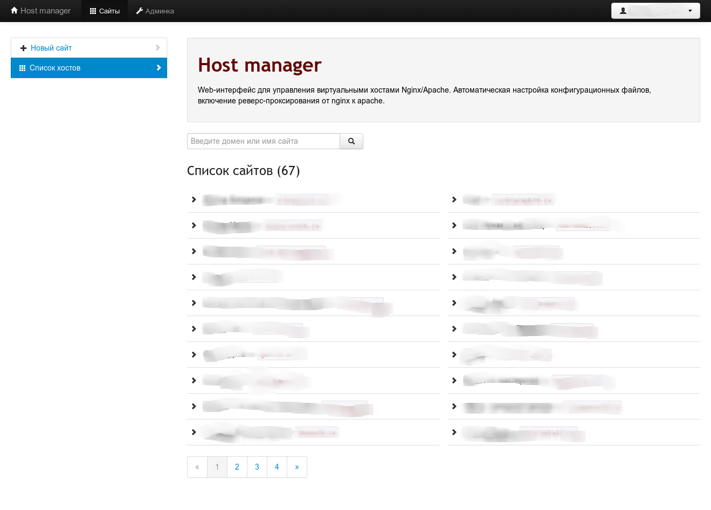

# Hostmanager

Минималистичная система управления виртуальными хостами. Написана на Django.



## Установка

Нужно создать пользователя, из-под которого будет запускаться WSGI-процесс.
Этому пользователю нужно дать права на перезагрузку apache и nginx,
создание пользователей, и еще несколько операций (через `/etc/sudoers`):

Пример выдачи прав в /etc/sudoers:

```
web ALL=(root, web) NOPASSWD:/etc/init.d/apache2 reload, /etc/init.d/nginx reload, /usr/sbin/useradd, /usr/sbin/userdel, /bin/ln, /bin/mkdir, /bin/chmod, /bin/chown, /usr/bin/unlink
```

Важно, чтобы при выполнении этих действий из-под `sudo` не выполнялся запрос пароля.

Пример конфигурации Apache для запуска HostManager:

```apache
VirtualHost *:81>
    ServerName manager.myhosting.ru

    WSGIScriptAlias / /path/to/wsgi.py
    WSGIDaemonProcess hostmanager user=web group=web\
                      processes=2 threads=4 maximum-requests=100 display-name=apache-user-wsgi
    WSGIProcessGroup hostmanager

    ErrorLog /var/logs/hostmanager.error.log
    CustomLog /var/logs/hostmanager.access.log combined
</VirtualHost>
```

Пример конфигурации Nginx:

```nginx
server {
    listen 80;
    server_name manager.myhosting.ru;

    access_log  /var/log/nginx/hostmanager.access.log;
    error_log  /var/log/nginxhostmanager.error.log;
    
    location /static {
        root /path/to/project/dir;
        access_log off;
        expires max;
        break;
    }

    location /media {
        root /path/to/project/dir;
        access_log off;
        expires 5d;
        break;
    }

    location = /favicon.ico {
        root /path/to/static;
        access_log off;
        expires max;
        break;

    }

    location = /robots.txt {
        root /path/to/static;
        access_log off;
        break;
    }

    location / {
        proxy_pass http://127.0.0.1:81;
        proxy_set_header X-Real-IP $remote_addr;
        proxy_set_header X-Forwarded-for $remote_addr;
        proxy_set_header Host $host;
        proxy_connect_timeout 60;
        proxy_send_timeout 90;
        proxy_read_timeout 90;
        proxy_redirect off;
        proxy_set_header Connection close;
        proxy_pass_header Content-Type;
        proxy_pass_header Content-Disposition;
        proxy_pass_header Content-Length;
    }
}
```
